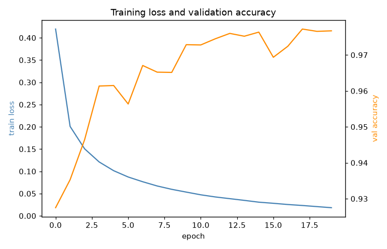
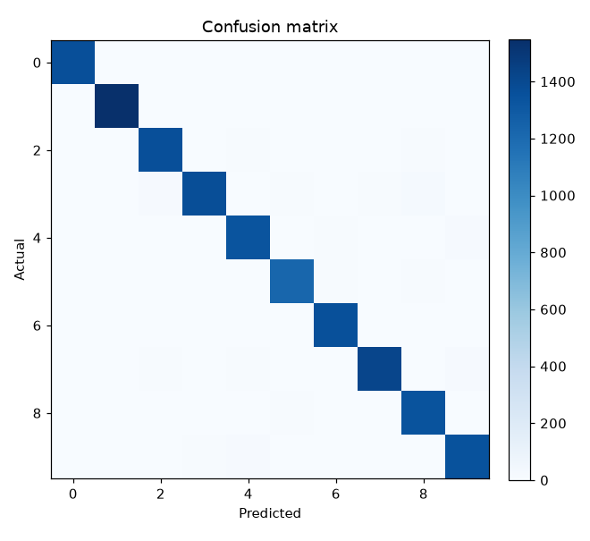
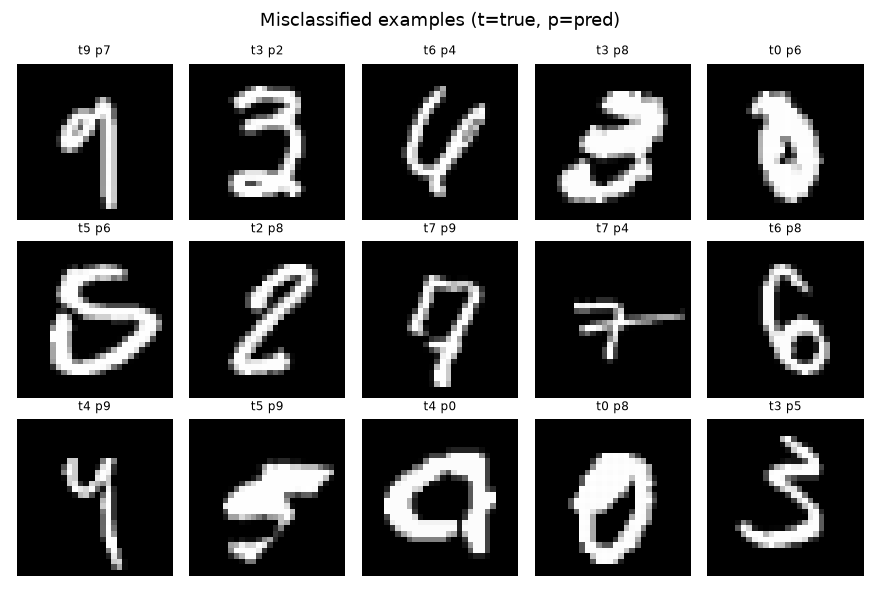
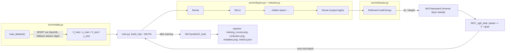

# Neural Network From Scratch — Backprop in Pure NumPy (MNIST)

> A small feed-forward network — Dense layers, ReLU, fused softmax cross-entropy, mini-batch SGD — with forward and backward passes written by hand in NumPy. No PyTorch, no TensorFlow, no autograd.


## What it does

Trains a configurable multi-layer perceptron (`Dense -> ReLU -> ... -> Dense`)
for handwritten-digit classification, with every forward and backward equation
implemented directly in NumPy — no autograd framework. It downloads MNIST
(784 features, 10 classes) via scikit-learn's OpenML fetcher, or falls back to
the bundled `sklearn.datasets.load_digits` set (64 features, 10 classes) if
the download is unavailable, so the project runs offline too.

A run trains the network with mini-batch SGD, prints per-epoch loss and
validation accuracy, and writes training curves, a confusion matrix, a grid of
misclassified digits, and a `metrics.json` summary to `reports/`.

Results committed in this repo (`reports/metrics.json`, reproduced with the
fixed seeds in the code):

| Dataset | Architecture | Test accuracy |
| --- | --- | ---: |
| MNIST (56k train / 14k test) | 784-128-64-10, 20 epochs, lr 0.1 | **0.977** |
| sklearn digits (offline fallback) | 64-128-64-10, 20 epochs, lr 0.1 | 0.947 |





## Architecture



Each layer (`Dense`, `ReLU`) implements the same contract:

```python
forward(x)            -> output          # caches what backward needs
backward(grad_output) -> grad_input      # and stores parameter gradients
```

`grad_output` is `dL/d(output)` arriving from the next layer; each layer
multiplies by its local derivative (the chain rule) to produce `dL/d(input)`
for the previous layer. `MLP.backward` runs this in reverse layer order — one
sweep that fills every parameter gradient. `SoftmaxCrossEntropy` fuses softmax
and cross-entropy for numerical stability and gives the clean gradient
`dL/dlogits = (softmax(logits) - y_onehot) / n`.

### Hand-tracing one backprop step

One example, 2-class head, logits `z = [2.0, 0.0]`, true class `0`
(`y = [1, 0]`), batch size `n = 1`:

1. softmax: `p = [e², e⁰]/(e² + e⁰) = [0.881, 0.119]`
2. loss: `-log(0.881) = 0.127`
3. gradient at logits: `(p - y)/n = [0.881 - 1, 0.119 - 0] = [-0.119, 0.119]`
4. into the last Dense layer: `dW = aᵀ·[-0.119, 0.119]` where `a` is that
   layer's input; `db = [-0.119, 0.119]`; pass `[-0.119, 0.119]·Wᵀ` further back.
5. SGD: `W -= lr·dW`.

The negative gradient on the true class pushes its logit **up**; the positive
gradient on the wrong class pushes its logit **down** — exactly what we want.
`test_gradient_check_dense_parameters` confirms these analytical gradients
match finite-difference numerical gradients to ~1e-6.

## Quickstart

```bash
python -m venv .venv && source .venv/bin/activate   # Windows: .\.venv\Scripts\activate
pip install -e ".[dev]"

python train.py                 # downloads MNIST, trains 20 epochs, writes reports/
python train.py --no-mnist      # use the bundled sklearn digits set (no download)
python train.py --epochs 5 --lr 0.05 --hidden 256 128 --batch-size 64

pytest -q                       # 7 tests, including gradient checking
```

Verified against the code in this repo: `train.py --no-mnist` runs correctly
end to end with only `numpy`, `scikit-learn`, `matplotlib`, and `pandas`
installed, and reproduces the 0.947 digits-set accuracy above with the default
20 epochs. `pytest -q` passes all 7 tests, including the finite-difference
gradient check.

## Project structure

```
src/nn/
├── __init__.py   # public API: Dense, ReLU, SoftmaxCrossEntropy, softmax, MLP, load_dataset, one_hot
├── layers.py      # Dense (He init) and ReLU; forward + backward
├── losses.py      # fused softmax cross-entropy + numerically-stable softmax
├── network.py     # MLP: forward/backward orchestration + mini-batch SGD training loop
└── data.py        # MNIST via OpenML, with sklearn-digits fallback; one_hot encoding
train.py           # CLI entry point: builds the MLP, trains it, writes figures + metrics.json
tests/test_nn.py   # 7 tests: unit tests, gradient checking, tiny-batch overfit sanity check
reports/           # committed training curves, confusion matrix, mistakes grid, metrics.json
```

## Key design decisions

- **He initialisation** (`Var = 2/fan_in`) for Dense-layer weights keeps signal
  and gradient magnitude stable across ReLU layers; biases start at zero.
- **Softmax and cross-entropy are fused** into one `SoftmaxCrossEntropy` class
  rather than composed, both for numerical stability (max-subtraction trick
  before `exp`) and because the fused backward pass collapses to the single
  clean expression `(softmax(logits) - y_onehot) / n`.
- **Correctness is proven by gradient checking**, not just by falling loss.
  `tests/test_nn.py::test_gradient_check_dense_parameters` perturbs random
  parameter entries by `±1e-5` and compares the finite-difference estimate
  against the analytical backprop gradient — they agree to `~1e-6`. There is
  also a test that the network can drive train loss to near zero on a tiny
  20-sample batch, which fails immediately if learning is broken.
- **MNIST-first with a deterministic offline fallback.** `load_dataset` tries
  `fetch_openml("mnist_784")` and falls back to `sklearn.datasets.load_digits`
  on any exception (no network, no OpenML cache), so the project always runs.
  The network code is identical either way — only `data.py` branches.
- **All randomness is seeded** (`RANDOM_STATE = 42` for the train/test split,
  explicit `seed=` per `Dense` layer, a seeded RNG for shuffling in `MLP.fit`),
  so the results above are reproducible from a clean checkout.

## Limitations

- **The test set doubles as the validation set.** `train.py` passes `X_test,
  y_test` into `MLP.fit` as `X_val, y_val` purely to print per-epoch progress;
  there is no early stopping or checkpoint selection based on it today, so the
  final reported accuracy is not currently biased by this. But it means there
  is no genuinely held-out data, and adding any form of model selection later
  (early stopping, hyperparameter search) would leak test information. A
  three-way split (train/val/test) would fix this properly.
- **No model persistence.** Training results (weights) are not saved anywhere
  — only figures and `metrics.json`. There is no way to reload a trained model
  without retraining from scratch.
- **Plain mini-batch SGD only** — no momentum, Adam, learning-rate schedule,
  or regularisation (L2/dropout). This is intentional for the "hand-trace one
  backprop step" teaching goal, but it means accuracy is bounded well below
  what MNIST supports with a modern optimiser.
- **No CI.** The test suite exists and passes locally but nothing runs it
  automatically on push or PR.
- Only Dense/ReLU/softmax-cross-entropy are implemented — no convolutional
  layers, no other activations or losses.

## Roadmap

- Split off a genuine validation set distinct from the test set.
- Add `MLP.save`/`MLP.load` (e.g. `np.savez` of each layer's `W`/`b`) so a
  trained model can be reused without retraining.
- Add a GitHub Actions workflow to run `pytest` on push/PR.
- Optional SGD momentum and a learning-rate schedule as a natural next step
  beyond the current from-scratch scope.

## License

MIT. MNIST is a public benchmark dataset.
